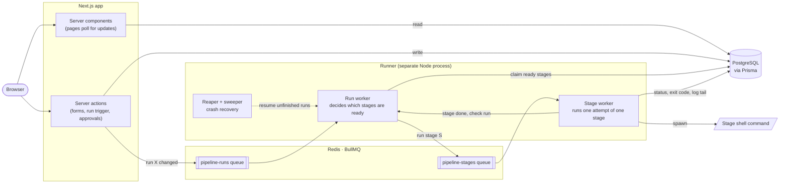

# Deplo

**A self-hosted CI/CD platform: draw a pipeline as a graph, then watch it run.**

[](https://github.com/kylegutierrez51/Deplo/actions/workflows/ci.yml)

Deplo is a full-stack deployment automation tool built with **Next.js 16, React 19, TypeScript, PostgreSQL, Redis and BullMQ**. You build a pipeline in a drag-and-drop graph editor, where each node is a **stage**, a shell command such as build, test, or deploy, and each edge between nodes is a dependency. Deplo saves it as a versioned definition and checks it for problems like cycles before it can run.

A separate worker process, the **runner**, then executes the stages in dependency order, running independent ones in parallel, retrying failures, pausing at manual approval gates, and sending each stage's logs back to the UI while it runs. Secrets are encrypted at rest with AES-256-GCM, injected only into the stages that need them, and masked in the logs. The runner is built to survive crashes: if it dies mid-run, it picks up where it left off on restart.

<!--
  Screenshot or GIF goes here. It's the first thing most readers look at.
  e.g. 
-->

## Features

- **Visual pipeline editor.** Drag stages onto a canvas and connect them ([React Flow](https://reactflow.dev)). Each stage has its own command, timeout, retry count, environment variables and secrets.
- **Versioned definitions.** Saving a pipeline creates a new version only when something actually changed, so a run always records exactly which pipeline it executed.
- **Validation before running.** Deplo rejects cycles (and shows the loop as a readable path), connections to or from a stage that no longer exist, stages without a command, and deploy stages that have no approval gate in front of them.
- **Parallel, dependency-ordered execution.** Independent stages run at the same time. Each stage has a timeout and a retry budget, and a run can be cancelled partway through.
- **Manual approval gates.** A run pauses at an approval stage until someone approves or rejects it.
- **Live logs.** Stage output appears on the run page while the command is still running, and each retry attempt keeps its own logs and exit code.
- **Logs Mask Secrets.** An Aho-Corasick matcher masks secrets in the logs by checking each chunk of text from the stage output, even when chunks arrive in separate intervals.
- **Environments and encrypted secrets.** Secrets are scoped to an environment (dev, staging, production) and decrypted just before the stage that uses them starts.
- **Audit log.** Changes to pipelines, runs, environments, secrets and webhooks are recorded along with who made them.
- **GitHub sign-in** via OAuth (NextAuth).

## Architecture



**How a run works:**

1. Clicking **Run** writes a `PipelineRun` row to Postgres and adds a job to the `pipeline-runs` queue.
2. The runner reads the run's stage rows, works out which stages have all their dependencies finished, marks them queued, and adds one `pipeline-stages` job for each.
3. A stage worker loads the stage's config from Postgres, decrypts its secrets, and runs the command in a working directory set aside for that run. Every 2 seconds it saves the latest output so the UI can show it.
4. When the command exits, the worker records the result (or opens a retry) and hands the run back to step 2. This repeats until every stage has finished or one has failed.

The runner keeps nothing in memory between steps. All state lives in Postgres, so a restarted runner can continue any run from where it stopped.

## Engineering highlights

Parts of the project that took the most care to get right:

- **Crash-safe scheduling.** Every database write in the runner is a compare-and-swap: an `UPDATE ... WHERE status = <expected>`. When two workers race, exactly one succeeds and the other backs off, so a stage can never be queued twice. On boot, a *reaper* retries or fails stages left `RUNNING` by a dead process and frees their jobs in Redis. A *sweeper* runs every 60 seconds and restarts any run that stalled while Redis or Postgres was briefly unavailable.
- **Retries that don't lose history.** Each retry is a new row in the database, so the failed attempt keeps its own exit code and logs. The retry row is written *before* the failure is recorded. If it was written after, then it leaves a gap in which a parallel stage finishing could mark the whole run failed while the retry is still pending.
- **Secrets never reach Redis.** Queue jobs carry only IDs. Secrets are decrypted just before the command starts, and only for the run's own environment. Keys like `ENCRYPTION_KEY` and `DATABASE_URL` are removed from the command's environment. Secret values are masked in log output with a single-pass [Aho-Corasick](https://en.wikipedia.org/wiki/Aho%E2%80%93Corasick_algorithm) matcher.
- **Killing the whole process tree.** A command run with `shell: true` starts a shell, which then starts the real command. Killing only the shell would leave the real command running. Timeouts and cancellation therefore kill the entire process group, using a negative PID on Linux and `taskkill /T` on Windows. Both are tested, because development happens on Windows and CI runs on Ubuntu.
- **No hanging requests when Redis is down.** A Redis command made during an outage waits indefinitely instead of failing. Therefore, every queue call from the web app has a timeout, and a run that couldn't be queued is removed rather than waiting indefinitely.

## Tech stack

| Area | Tools |
|---|---|
| Frontend | Next.js 16 (App Router, React Server Components, Server Actions), React 19 + React Compiler, React Flow, CSS Modules |
| Backend | Node.js, TypeScript, Prisma ORM, PostgreSQL 16 |
| Job queue | BullMQ on Redis 8 |
| Auth | NextAuth v5 (GitHub OAuth, JWT sessions) |
| Testing | Jest, React Testing Library, Playwright |
| Tooling | GitHub Actions CI, Docker Compose, ESLint |

## Getting started

### Prerequisites

- **Node.js 24** (the version CI uses)
- **Docker**, which runs Postgres and Redis for you
- A **GitHub OAuth App** for signing in. Create one at [github.com/settings/developers](https://github.com/settings/developers) with the callback URL `http://localhost:3000/api/auth/callback/github`.

### Setup

```bash
# 1. Clone and install (postinstall also generates the Prisma client)
git clone https://github.com/kylegutierrez51/Deplo.git
cd Deplo
npm install

# 2. Configure environment variables, then fill in the blanks in .env
cp .env.example .env

# 3. Start Postgres and Redis
docker compose up -d

# 4. Create the database schema, and optionally load demo data
npx prisma migrate deploy
npx prisma generate
npx prisma db seed
```

`.env.example` explains every variable and how to generate each value. The ones you have to fill in yourself are:

| Variable | What it is |
|---|---|
| `AUTH_SECRET` | Key that signs session tokens. Generate with `node -e "console.log(require('crypto').randomBytes(32).toString('base64'))"`. |
| `AUTH_GITHUB_ID` / `AUTH_GITHUB_SECRET` | The Client ID and Client Secret of your GitHub OAuth App. |
| `ENCRYPTION_KEY` | 32 random bytes written as 64 hex characters, used to encrypt secrets. |
| `RUNNER_WORKSPACE_ROOT` | Directory where the runner creates a working folder for each run. |
| `PROJECT_DIR` | Optional: Absolute path to this repo. Only the seeded demo pipeline uses it. |

### Run it

Deplo is two processes, so start each one in its own terminal:

```bash
npm run dev      # web app at http://localhost:3000
npm run runner   # worker that executes pipeline stages
```

Sign in with GitHub, open **Pipelines**, and either build a pipeline or open the seeded `verify-and-build` pipeline, which runs Deplo's own test suite (If you use the seed, you must have PROJECT_DIR set to the absolute path of Deplo for it to run Deplo's test suite!)

## Testing

Tests are split into three tiers, and CI runs all of them on every push and pull request, along with lint and type checks.

```bash
npm test                  # unit + component tests (Jest, jsdom, Prisma mocked)
npm run test:integration  # against a real Postgres: constraints, cascades, concurrency
npm run test:e2e          # Playwright: builds and starts the app, drives a real browser
```

Unit tests need no setup. The integration and E2E tests read their settings from `.env.test` instead of `.env`, and use a separate database in the same Postgres container:

```bash
cp .env.test.example .env.test
docker exec deplo-postgres createdb -U deplo deplo_test
```

Integration tests delete everything in the database between tests, which is why they need their own database. The setup refuses to run against a database whose name looks like the dev database. They also apply migrations before they start, but E2E tests don't, so run `npm run test:integration` once before your first `npm run test:e2e`.

## Project structure

```
app/         Next.js pages (one route per resource)
components/  UI: pipeline editor, run detail, modals, shared primitives
lib/         Data access, server actions, pipeline validation, encryption, queue client, utilities
runner/      The worker process that executes stages (see runner/README.md)
prisma/      Database schema, migrations, seed data
e2e/         Playwright tests
```

## Known issues and roadmap

- **GitHub webhooks don't start runs yet.** You can register a webhook in the UI, but there is no endpoint to receive GitHub's events, so a push doesn't trigger a run.
- **Search boxes don't filter anything.** The search input on each list page accepts text but isn't connected to the query.
- **Nodes can't be copied and pasted** in the pipeline editor.
- **Stage commands run directly on the runner's machine**, with the runner's permissions. There is no container isolation.
- **Only one runner process is supported.** Crash recovery assumes it's the only runner, so you can't scale out by starting more.
- **The seeded demo pipeline only runs on Windows.** Its commands use `cmd` syntax (`cd /d "%PROJECT_DIR%"`).
- **A repo URL ending in `.git` or `/` is displayed incorrectly.** The repository name shows up with a `.git` suffix, or blank.
